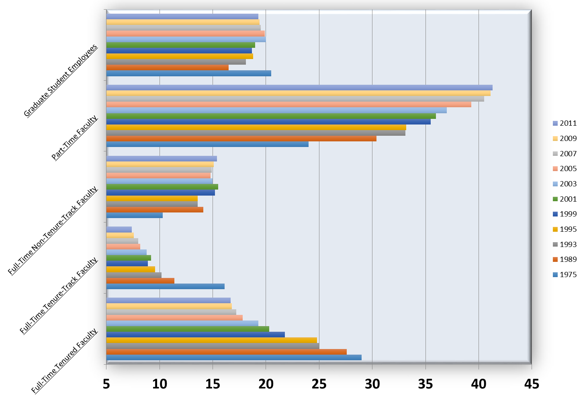
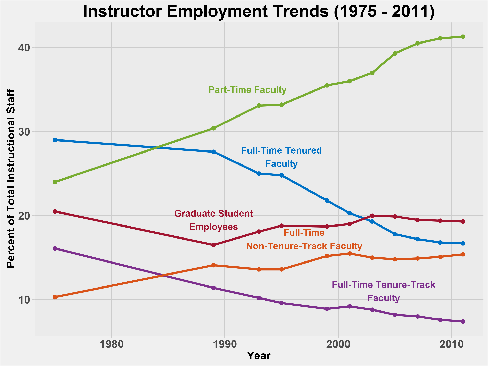

## Data Visualization Exercise

### Transforming Data

The data on percentage of instructors over time comes from a 2013 American Association of University Professors (AAUP) report.
An excel-based visualization was the starting point of this assignment.

**Problems with the orginal visualization**

* Date is a catagorical value making it hard to track trends over time.
* To many colors becomes confusing; the choice of colors could be more pleasing.
* Bars and background have shading which is a distracting visual choice.
* Tilted catagory labels make it hard to read.
* No labels on x-axis and legend make it unclear what is being compared.
* Numerical axis does not begin at zero making bars perceptually difficult to compare. 

### Plotting with ggplot2

**Problems resolved with the new plot**

* Date is now a continous variable making it easier to compare trends over time. In addition, it is much easier to see how the dates are not evenly spaced.
* Colors have been reassigned to the five faculty types increasing visual distinctiveness. In addition, colors have been chosen that are saturated, distict, and pleasing. 
* A flat light gray background makes the plot distinct but doesn't overpower the content.
* Bold catagory labels make information stand out. In addition color-coded faculty labels makes it easier to match groups. 

**Problems not resolved with the new plot**

* Numerical axis still does not start at zero. A tradeoff between aestetics and accuracy. 